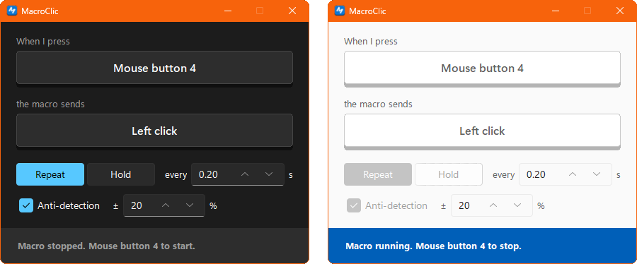

# MacroClic

**Website:** https://notdjz.github.io/MacroClic/

Press one key or mouse button to make Windows repeat, or hold down, another one for you. Built for games: the trigger works while the game has focus, and the game never sees it.



## Download

Get `MacroClic.exe` from the [latest release](../../releases/latest). It is a single file, with nothing to install.

Windows SmartScreen or your antivirus may warn about it, because the exe is unsigned and it reads and sends input. The source is all here, and you can [build it yourself](#build-from-source).

## Use

1. Click the first key, then press the key or mouse button that will start and stop the macro. Left click can't be used here, since every click would then be swallowed.
2. Click the second key, then press what the macro should send: a key, or a left, right, middle or side mouse button.
3. Choose **Repeat** and set how often to press, in seconds, or **Hold** to keep it held down. In Repeat, tick **Anti-detection** to vary each wait at random by up to the percentage you set, either way: 1 s at 50 % presses about every 0.5 to 1.5 s.
4. Press your trigger anywhere to start, and press it again to stop.

Press Esc while choosing a key to cancel. Settings are saved in `%APPDATA%\MacroClic\config.json`.

**Games running as administrator:** Windows blocks input from a normal program to an elevated one. Right-click `MacroClic.exe` and choose *Run as administrator*.

## How it works

- Keys are sent as hardware scan codes, and clicks as raw mouse events, through `SendInput`. Games reading DirectInput or Raw Input see them like real input.
- Low-level keyboard and mouse hooks catch the trigger and swallow it. They ignore injected events, so the macro can't trigger itself.
- Nothing is left pressed: every press is paired with its release, and everything is released on exit and on the next start.

## Build from source

Python 3.13 on Windows:

```
pip install -r requirements.txt pyinstaller
python macroclic.py
python test_macroclic.py
python -m PyInstaller --onefile --windowed --name MacroClic --icon macroclic.ico --add-data "macroclic.ico;." --collect-data sv_ttk macroclic.py
```

Pushing a `v*` tag builds the exe on GitHub Actions and publishes it as a release.

## License

MIT
